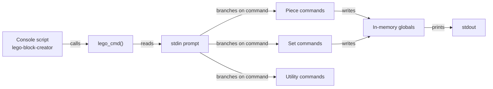

# Architecture

LEGO Block Creator is a single-file program. `main.py` holds one function,
`lego_cmd()`, which prompts for a command, branches on the answer, prompts for
whatever that command needs, prints a result, and returns.

## Overview

There are no modules, classes, or layers. The whole program is one branch
chain, which is why the test suite mocks `input` and `print` rather than
calling any internal API.



## Components

### `main.py`

The entire program. `lego_cmd()` handles one command per call: it reads a
command name, runs a chain of `elif` branches to find a match, collects the
values that command needs through further `input()` calls, and prints the
result. An unrecognised command prints an error pointing at `help`.

### `__main__.py`

Lets the package be run as `python -m` from a checkout.

### `setup.py`

Declares the console script entry point that makes `lego-block-creator`
available on `PATH` after a pip install:

```python
entry_points={"console_scripts": ["lego-block-creator=main:lego_cmd"]},
```

### `pyproject.toml`

Project metadata, plus the pytest and coverage configuration. Coverage is
measured against `main` specifically, since that is where all the logic lives.

## Data flow

One invocation handles exactly one command:

```mermaid
sequenceDiagram
  participant U as User
  participant C as lego_cmd()
  participant S as In-memory globals
  U->>C: command name
  C->>U: prompt for values
  U->>C: values
  C->>S: store or read
  C->>U: printed result
  Note over C: function returns; process exits
```

## State and persistence

Values are held in module-level globals created with the `global` statement
inside each branch. `main.py` contains no `open()` call, no database driver,
and no serialisation of any kind.

Two consequences follow, and both are load-bearing when reading the code:

- **Nothing survives the process.** The inventory is gone when the program
  exits. "Offline" in the project description means "needs no network", not
  "stores your data locally".
- **One command per run.** `lego_cmd()` returns after handling a single
  command rather than looping, so each command starts from an empty inventory.

Adding persistence would be the change that makes the sorting commands useful
across sessions.

## Directory layout

```text
.
├── main.py            The entire program: lego_cmd()
├── __main__.py        Enables `python -m`
├── setup.py           Console script entry point
├── pyproject.toml     Metadata, pytest and coverage config
├── Dockerfile         Python 3 base, non-root user
├── requirements.txt   Test dependencies only
├── tests/             pytest suite, mocks input and print
└── docs/              Source for this site
```

## Design decisions

**One file, no abstractions.** The program is a branch chain rather than a
command registry or class hierarchy. At 365 lines this stays readable, and the
test suite covers it fully by mocking stdin and stdout. The cost is that adding
a command means extending the chain rather than registering a handler.

**Coverage scoped to `main`.** `pyproject.toml` sets `--cov=main` rather than
covering the whole tree, because `setup.py` and `__main__.py` are packaging
glue with no behaviour worth asserting on.

{{ support() }}
